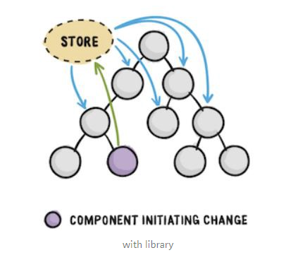
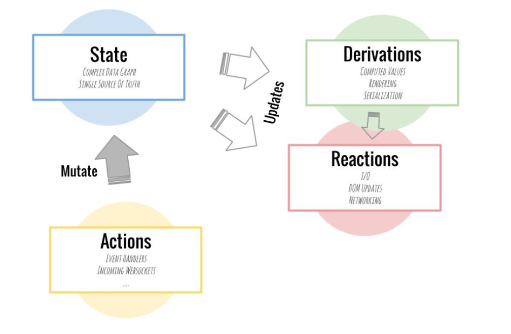

MobX
========

- React를 위한 상태 관리 라이브러리

- 하나 혹은 다수의 store(저장소)를 두고 그곳에서 state를 저장해 둔다. 이제 props를 전달할 때 등 데이터의 이동의 절차가 매우 줄어들게 된다.

##### core idea

1. state
    - value
2. derivations
    - any value that can be computed automatically from the state
3. reactions
    - similar to derivations
    - but don't produce a value
    - 주로 I/O와 관련된 특정 작업들을 자동으로 수행
    - 자동으로 적당한 때에 DOM update, network request ... 을 함(real time)
4. actions
    - 상태를 변화시키는 모든 것
    - action으로 발생한 상태 변화는 모두 자동으로 derivations과 reaction으로 처리
    - 동기화 되고 결함이 없다?
    (Synchronously and glitch-free)

###### mobx-react-devtools
- 실행 과정 디버깅